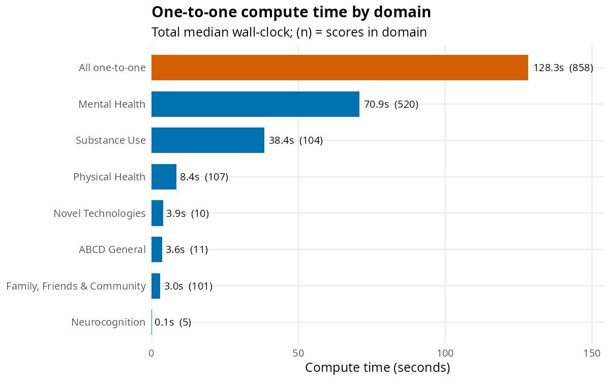
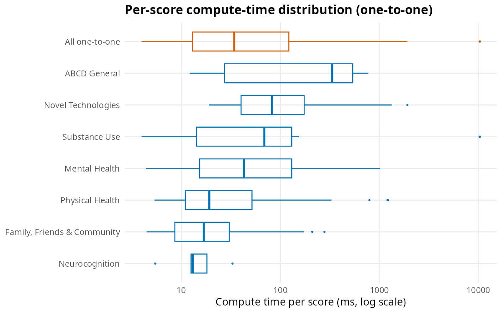
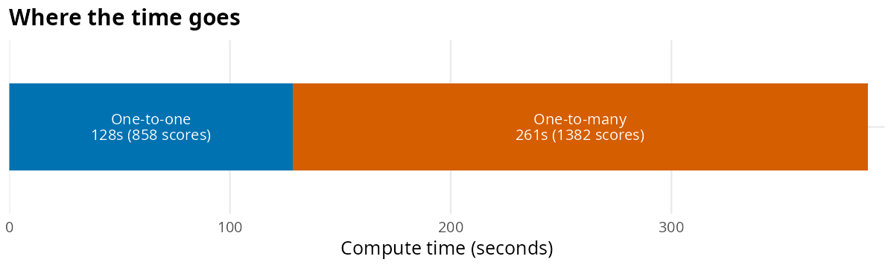

# Performance & scalability benchmark

`ABCDscores` is designed to compute the full set of summary scores for a
complete ABCD Study^(®) data release on an ordinary laptop, without
multi-core parallelization or specialized hardware. This article reports
a reproducible benchmark that quantifies that claim on the ABCD 7.0
release.

## Method

The benchmark loads each tabulated 7.0 table, strips the pre-computed
summary columns the release already ships, and then times **only the
execution of the score-computing functions** — data loading, joining,
and result bookkeeping are excluded, since those reflect storage/IO
rather than the scoring code. Each score’s computation is repeated three
times and summarized by the median; all timings are **single-threaded**.

Two classes of function are reported separately:

- **One-to-one functions** — one exported `compute_*()` function
  produces one score (the large majority of the package).
- **One-to-many functions** — a compact, configuration-driven routine
  produces many scores at once (medications, SDSU, SUI, family history).

The `compute_*_all()` convenience wrappers are **not** timed on their
own, as they merely re-run the one-to-one functions. **TLFB and Fitbit
scores are excluded**: their inputs are raw daily-event and device-epoch
data that are not part of the *tabulated* release (only their
pre-computed summaries ship), so they cannot be recomputed from tabular
data.

All numbers below were measured single-threaded on an **Intel Core
i7-13700H** (20 logical cores, 30.5 GB RAM), Linux, R 4.6.1.

## Headline result

- **858 one-to-one scores** computed in **128.3 s**
- **1,382 one-to-many scores** computed in **260.6 s**
- **All 2,240 scores in 388.9 s** (≈6.5 min) of single-threaded compute
  time
- Peak R memory **9,100 MB**; one-time data load (excluded above) **40.8
  s**

In outline, the timing loop is:

``` r

arrow::set_cpu_count(1L) # single-threaded
# per table: load, strip only the target score, time each fn over 3 reps
for (tbl in tables) {
  d0 <- load_joined(c(tbl, "ab_g_stc", source_tables_of(tbl)))
  for (fn in one_to_one_fns_of(tbl)) {
    d <- dplyr::select(d0, !dplyr::any_of(score_of(fn))) # strip target only
    time_ms(function() get(fn)(d), reps = 3) # median of 3
  }
}
# one-to-many routines timed via their shipped configs, e.g. family history:
# time_ms(function() purrr::map(famhx_config$call, ~ eval(parse(text = .x))))
```

## One-to-one timing by domain

The bar at the top pools all domains to show the overall one-to-one
compute time.



One-to-one compute time by domain

## How fast is a one-to-one score?

Across the 858 one-to-one functions, the median score computes in **34
ms**; the middle 90% fall between 6 and 610 ms, with a full range of
4–10,386 ms. The box at the top pools every one-to-one score across all
domains.



Per-score compute-time distribution

## One-to-many functions

Configuration-driven routines produce many scores per call. Because each
is one bulk operation over the whole cohort, its cost is reported as a
whole and as an average per score produced.

| Group                 | Table        | Scores | Time (s) | Per score (ms) |
|-----------------------|--------------|-------:|---------:|---------------:|
| meds:ph_p_meds:catg   | ph_p_meds    |    330 |     9.99 |           30.3 |
| meds:ph_p_meds:estuse | ph_p_meds    |    285 |    12.62 |           44.3 |
| meds:ph_y_meds:catg   | ph_y_meds    |    200 |     3.40 |           17.0 |
| meds:ph_y_meds:estuse | ph_y_meds    |    190 |     2.03 |           10.7 |
| meds:ph_p_dhx:catg    | ph_p_dhx     |     40 |     0.50 |           12.6 |
| famhx                 | mh_p_famhx   |     96 |    91.26 |          950.7 |
| sui                   | su_y_sui     |    100 |     1.30 |           13.0 |
| sdsu:use_yn           | su_y_dyn/stc |     47 |    67.08 |         1427.3 |
| sdsu:onset_event      | su_y_dyn/stc |     47 |    32.88 |          699.5 |
| sdsu:onset_age        | su_y_dyn/stc |     47 |    39.49 |          840.2 |

## Summary

In total, ABCDscores computed **2,240 summary scores in 388.9 s** (≈6.5
min) of single-threaded compute time: **858 one-to-one functions** in
128.3 s and **1,382 one-to-many scores** in 260.6 s.

| Class       | Scores | Compute time (s) | Share of time (%) |
|-------------|-------:|-----------------:|------------------:|
| One-to-one  |    858 |            128.3 |                33 |
| One-to-many |  1,382 |            260.6 |                67 |
| All         |  2,240 |            388.9 |               100 |



Where the time goes
